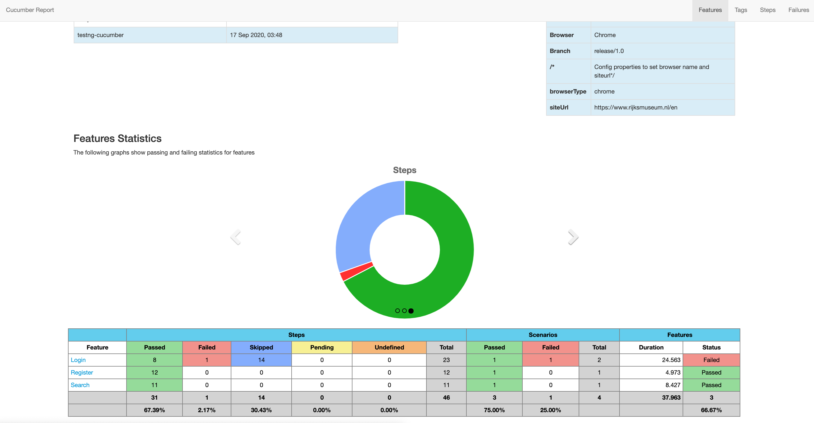
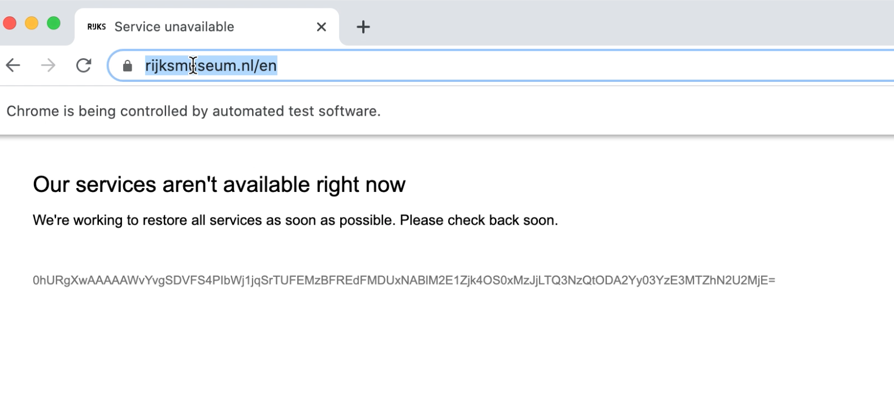

## Testng-Cucumber-
This is demo code bootstrap code with basic happy path test automation
## Features
* The test scenarious  should run successfully on **Chrome** as defined in the **config.properties** file.
* Support of different operation systems and browsers. The drivers are located at resources/drivers/.
* TestNG Annotations/hooks like "BeforeSuite", "AfterClass", "AfterMethod" etc.
* Upon test failure screenshots are created in the /screenshots directory.
* Reporting of test execution can be found at /target/cucumber-html-reports/overview-features.html
 

## Scenarios
 * 2.1 Sign up the website using a valid email
 * 2.2 Log into the website
 * 2.3   Create first collection
 * 2.3.1 User should be logged in
 * 2.3.2 Press on Explore Rijksstudio (magnifying glass) on the top menu and
                  search for “Johannes Vermmer”
                  
 * 2.3.3 Press the heart icon displayed at the bottom of the “The Milkmaid” picture and
 add it to your first collection.
 *  2.4 Advanced search to look for a specific author
 * Verify pictures are displayed
 * Snapshot on a failed test.
 
## Improvements: 
* Random user generator for the registration and login Scenario with external library like java-faker. https://github.com/DiUS/java-faker
* Create additional classes for dialogs and forms.
* Shorten xpath locators or avoid completely
* Move functions from page classes to dedicated helper classes.
* Dry step definition and no hard coded logic 

## Random issues
* The login button is protected by capture module 
* The advanced search form loses field entries on backend connection failure and does not recover.
* Test site unresponsive



## To Get Started

#### Pre-requisites
1. Java installed in the system
2. Maven installed in the system

#### Run Scripts
* For parallel execution right click and run parallel.xml with intellij 
* For single instance execution right click and run chrome.xml or firefox.xml
* or run the following maven command

```
mvn clean test
mvn verify -Dcucumber.options="--tags @Regression"
```

#### Gherkin
```
And I fill in the home page login form email field with "m9u8zi+9o9k92e81kk6g@sharklasers.com"

```
 
#### Step definition
```
@Then("^I fill in the home page login form email field with \"([^\"]*)\"$")
	public void i_fill_in_the_home_page_login_form_email_field_with(String email) throws Throwable {
		homePage.homePageLoginFormFieldEmail.sendKeys(email);;
	}
```


#### Pages and locators
```
package pages;

import main.CucumberRunner;
import org.openqa.selenium.WebDriver;
import org.openqa.selenium.WebElement;
import org.openqa.selenium.support.FindBy;
import org.openqa.selenium.support.PageFactory;

public class HomePage extends CucumberRunner {

@FindBy(id="email")
  public WebElement homePageLoginFormFieldEmail;


  public HomePage(WebDriver driver){
        this.driver = driver;
        PageFactory.initElements(driver, this);
    }
```